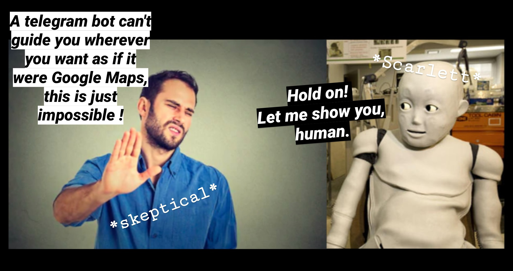
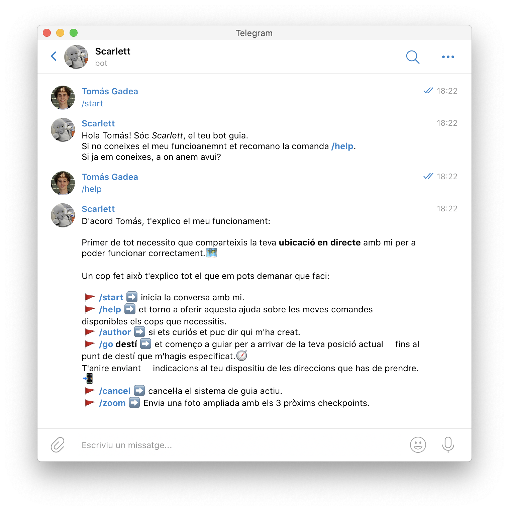
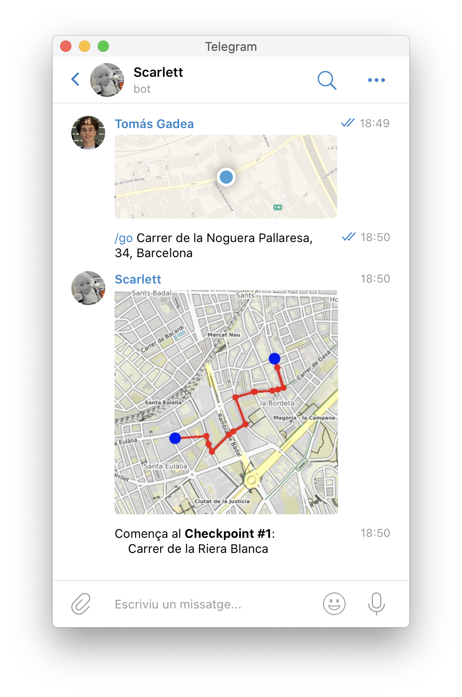
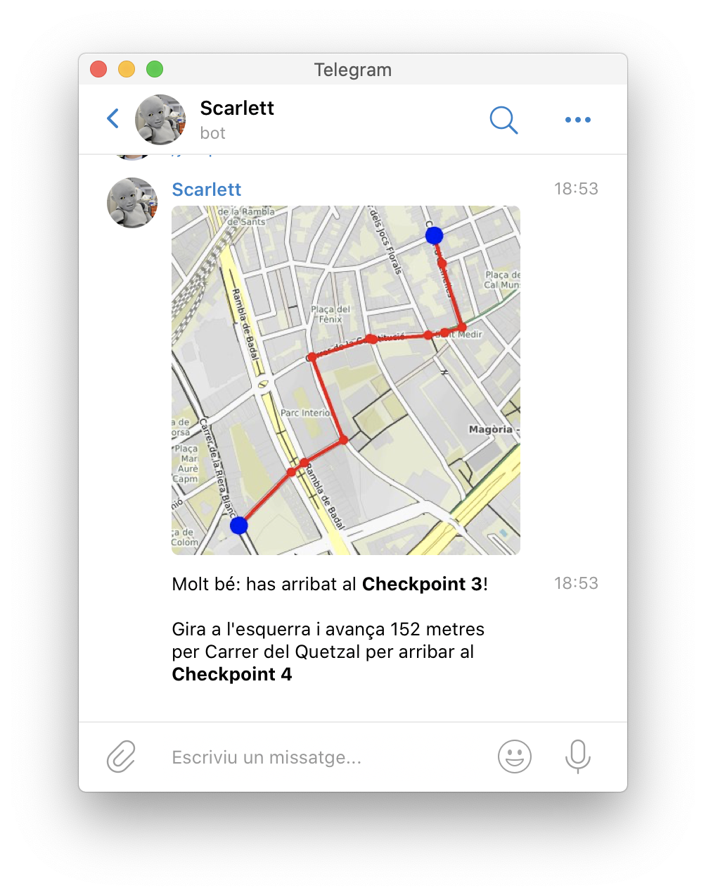
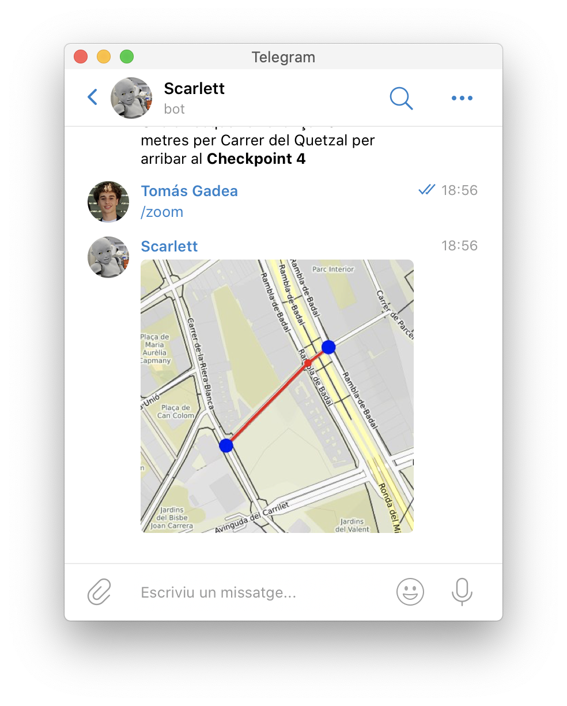
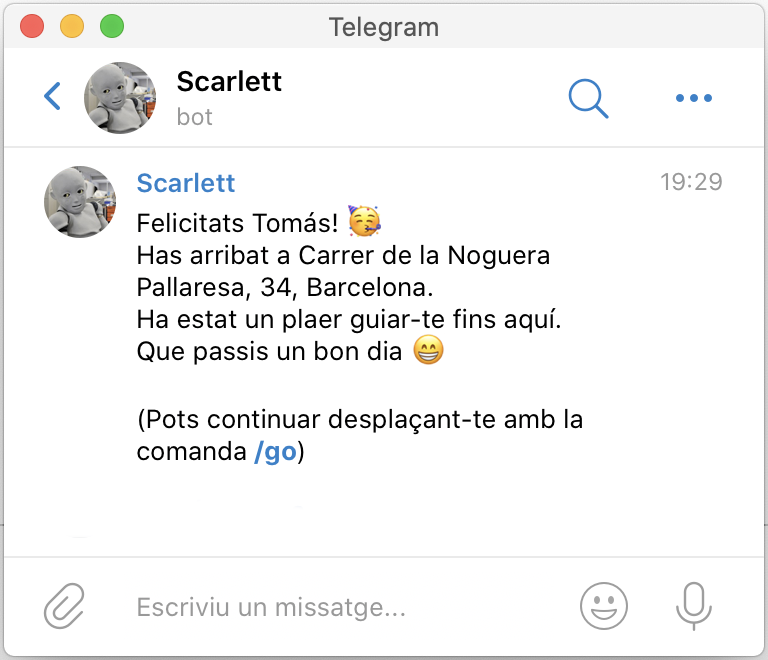
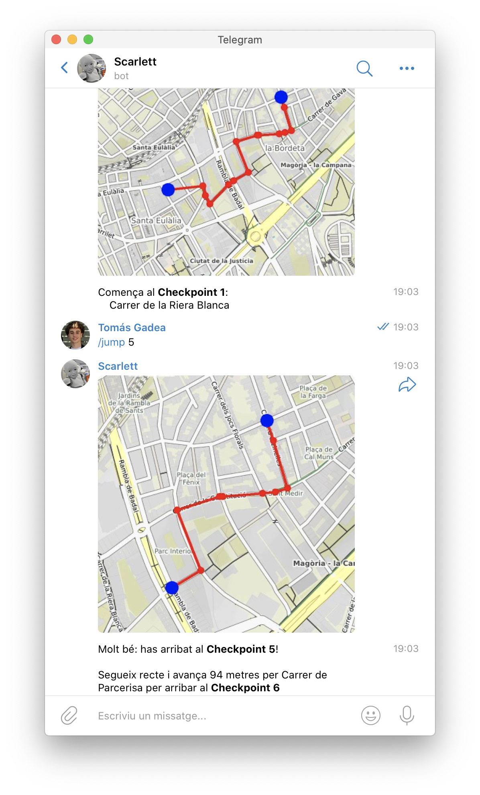
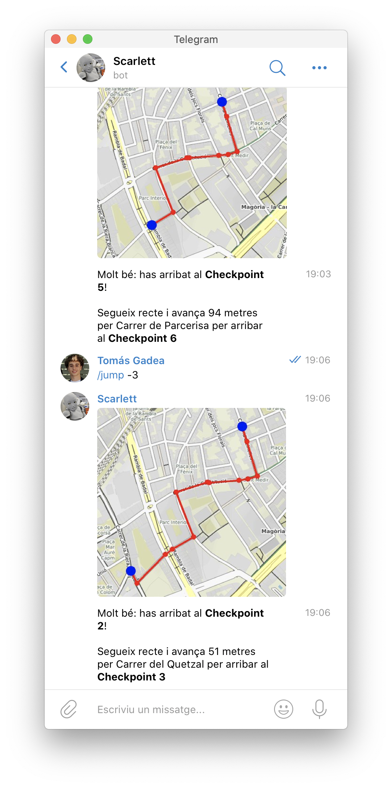

# Scarlett guidebot

<center></center>


## Getting Started

This project is divided in two parts:

* `guide.py` : Provides all the geographic operations, functions and algorithms applied to graphs that represent city networks. These operations go from downloading the graphs to getting the coordinates of an address, going through algorithmical computations as a graph shortest paths.

* `bot.py` : Provides all the code needed for the interaction between the telegram API, the users of the bot, and the bot itself. Based on the guide.py module, bot.py treats user requests at a high level of abstraction, without going into graph algorithms at all.


### Prerequisites

You will need to have `python3` and `pip3` updated. Check it with:
```
pip3 install --upgrade pip3
pip3 install --upgrade python3
```
If you are using macOS you will need to install the package manager [brew](https://brew.sh) in your environment using:
```
/bin/bash -c "$(curl -fsSL https://raw.githubusercontent.com/Homebrew/install/master/install.sh)"
```

To use the bot you will need a `Telegram` account as well as the `Telegram` app. It is available in [Play Store](https://play.google.com/store/apps/details?id=org.telegram.messenger&hl=ca), [App Store](https://apps.apple.com/es/app/telegram-messenger/id686449807) or in [Telegram's website](https://telegram.org).

### Installing

The packages needed for this bot are:
* **networkx** : Used for graph manipulation.
* **osmnx** : Used to deal with city networks.
* **haversine** : Used to compute distances in non euclidean spaces, specifically between two points in the Earth represented with geographic coordinates.
* **staticmap** : Used to draw or plot city maps.
* **python-telegram-bot** : Used to develop a telegram bot interface.
* **numpy** : Used for mathematical computations.

To install all the packages used in this bot you can execute the following command:
```
pip3 install -r requirements.txt
```

If you have problems with it you can install the packages one by one with `pip3 install` followed by the package name.

## Usage

**Note** : This bot is configured to work with _**Barcelona**_ street network by default, therefore, interaction with user is made in _Catalan language_. The city can be changed in the bot.py code.

To use the bot you must follow these steps:

* **FIRST STEP** - *run bot module* - Keep the module running, some comments and errors will be shown to the admin's terminal just to provide extra information (the bot won't crash). To run the script type and execute:
```
python3 bot.py
```
* **SECOND STEP** - *discover Scarlett* - Go to [Scarlett's telegram link](https://t.me/scarlett_guidebot), start the conversation, ask Scarlett for her commands with `/help` and follow the instructions.


* **THIRD STEP** - *start the journey* - After sharing your location with Scarlett you can give him your wanted destination with `/go destination`.


* **FOURTH STEP** - *in the trip* -
As you make progress in the route Scarlett will provide you updates of this type:
    * Image of the path
    * Information text:
        * Your current checkpoint.
        * Next steps to achieve the following checkpoint.


The steps to take are divided in the turn you must make followed by the distance you must travel. The turn can be one of these seven, depending on the relative angle of the street:


If you can't see clearly the map you can use `/zoom` in order to focus on the following immediate checkpoints:



Once you arrive to the last checkpoint, your destination, the journey will automatically finish and you can ask for another route again. You will recieve a message like this:



### Developer tools

To run tests with the bot you must follow the same steps shown for the regular usage, but instead of walking or moving yourself you can use `/jump x` to move you `x` checkpoints forward:



Also you can go backwards:



## Authors
[Tomás Gadea Alcaide](https://github.com/TomasGadea) and [Pau Matas Albiol](https://github.com/PauMatas)

For more information about the project, please contact us at: 01tomas.gadea@gmail.com and paumatasalbi@gmail.com

GCED, UPC, 2020
