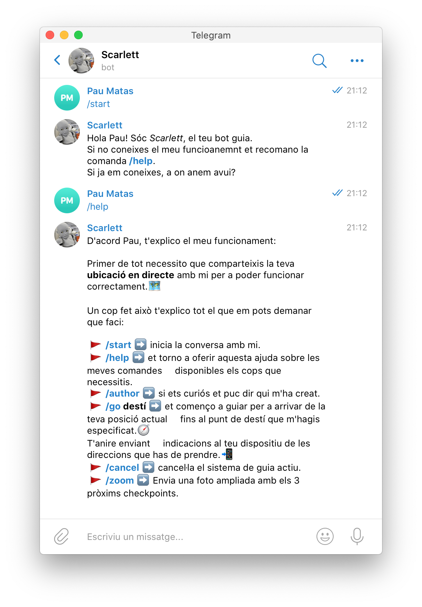
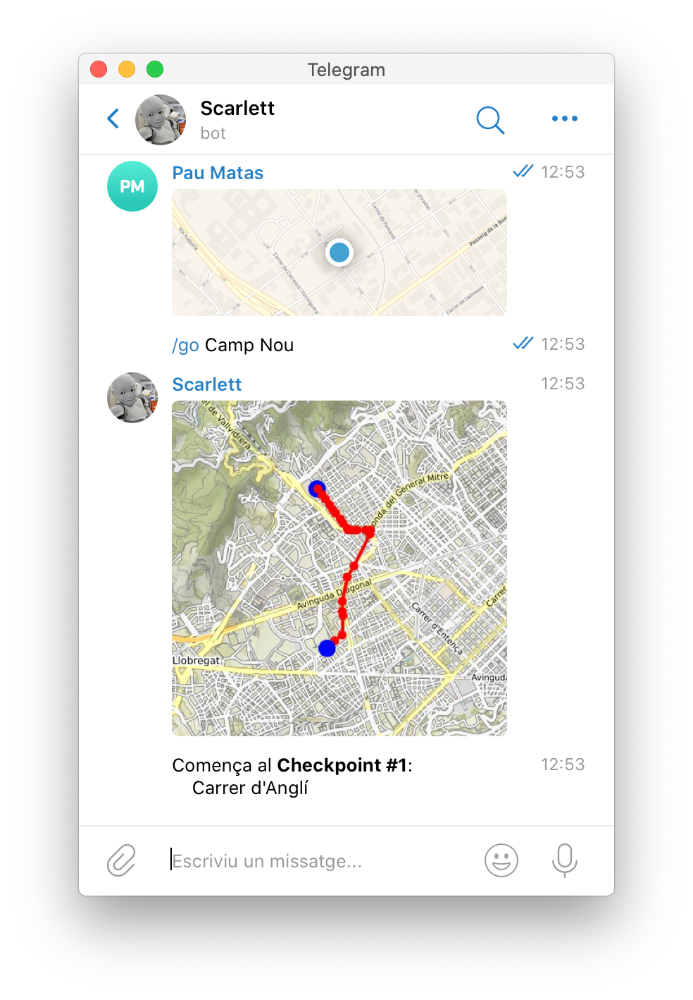
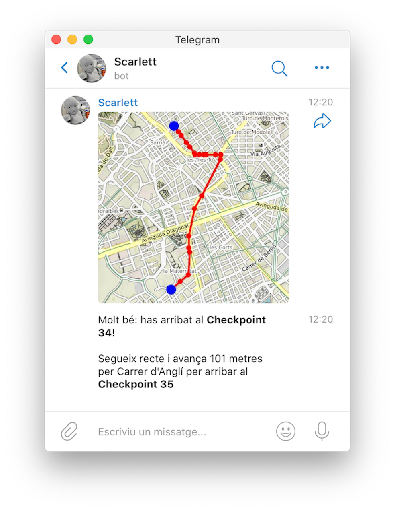
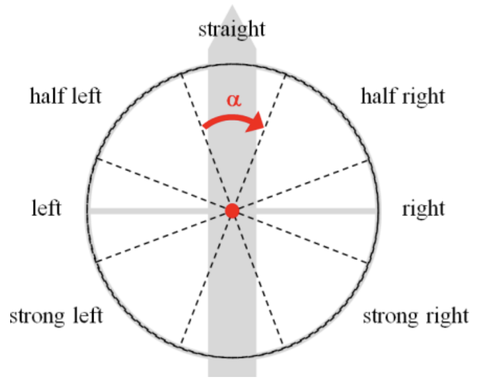
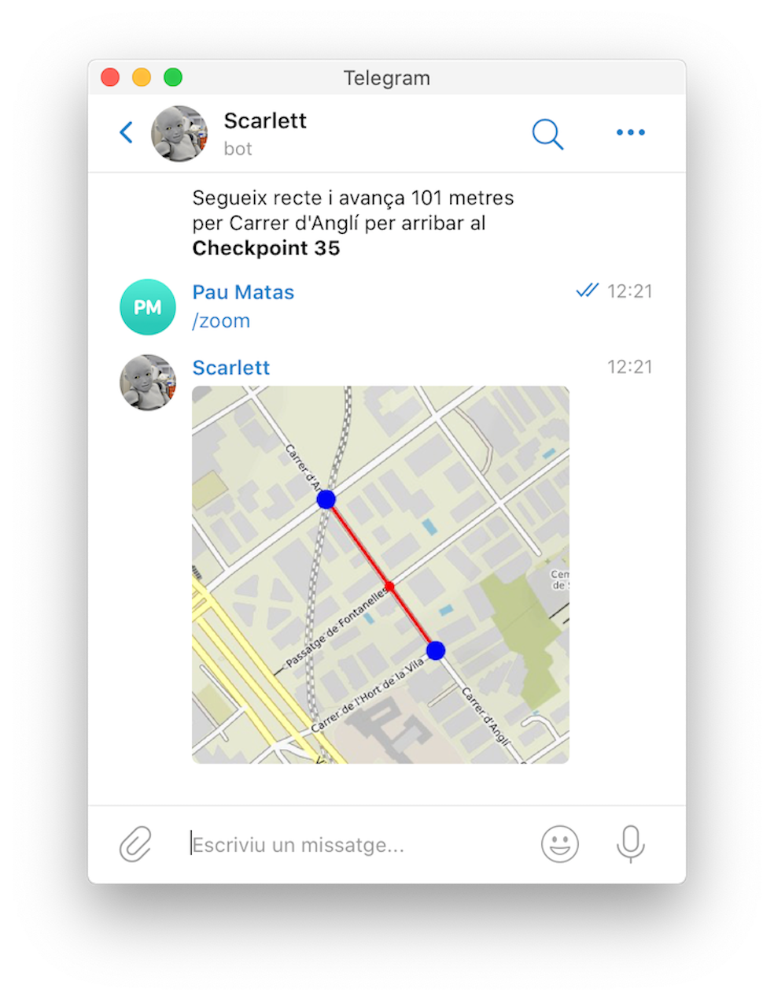
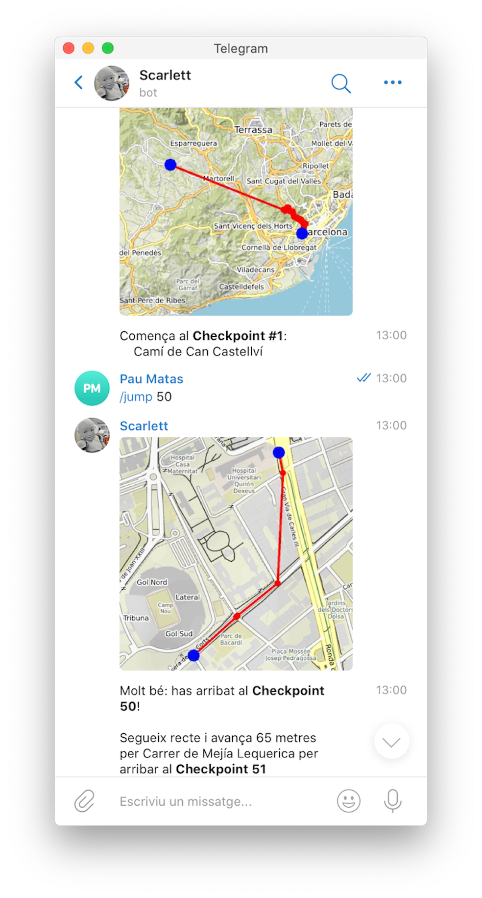
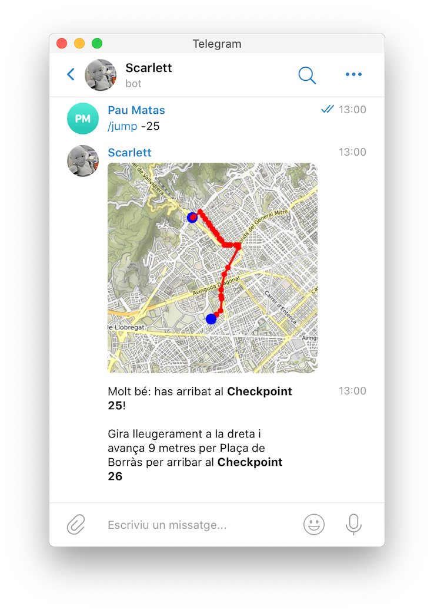

# Scarlett guidebot

One Paragraph of project description goes here

## Getting Started

This project is divided in two parts:

* `guide.py` provides all the geographic operations on the graphs representing maps. These operations go from getting the graphs to getting the coordinates of an address.

* `bot.py` provides all the telegram API. It's job is to guide the users to their destinations reading commands and using guide.

Although guide is used in bot, the libraries used on one module are not used in the other one because of they are focused in different utilities.

### Prerequisites

You will need to have `python3` and `pip3` updated. Check it with:
```
pip3 install --upgrade pip3
pip3 install --upgrade python3
```
If you are using macOS you will need to install [brew](https://brew.sh) in your environment using:
```
/bin/bash -c "$(curl -fsSL https://raw.githubusercontent.com/Homebrew/install/master/install.sh)"
```

To use the bot you will need `Telegram` app and an acount. It is available in [Play Store](https://play.google.com/store/apps/details?id=org.telegram.messenger&hl=ca), [App Store](https://apps.apple.com/es/app/telegram-messenger/id686449807) or in [Telegram's web](https://telegram.org).

### Installing

The libraries needed in this bot and their usage on it are:
* **networkx** used for graph manipulation.
* **osmnx** used for getting and treat with geographic graphs.
if you are using linux you only need.
* **haversine** used for calculating coordinates distances.
* **staticmap** used for drawing maps.
* **python-telegram-bot** used for developing a telegram bot interface.
* **numpy** used for mathematical calcules.

To install all the libraries used in this bot you can execute the next command:
```
pip3 install -r requirements.txt
```

If you have problems with it you can install the libraries one by one with `pip3 install` followed by the library name.

## Usage

To use the bot you must follow these steps:

* **FIRST STEP** - *run bot module* - Keep the module running, some comments and errors will be shown:
```
python3 bot.py
```
* **SECOND STEP** - *discover Scarlett* - Go to [Scarlett](t.me/scarlett_guidebot), start the conversation, ask Scarlett for her commands with `/help` and follow the instructions.


* **THIRD STEP** - *start the journey* - After sharing your localization with Scarlett you can give him your destination with `/go destination`.


* **FOURTH STEP** - *while moving*
During the route Scarlett will provide you updates of this type:

Their format is:
  * Your current checkpoint.
  * The next direction instruction, described by the following graphic:
  
  * The distance between you and the next checkpoint and the street that where you should do it.

  If you don't see very well the map you can use `/zoom`:


### Developer tools

To run tests with the bot you must follow the same steps of the normal use, but instead of walking or moving yourself you can use `/jump x` to move you `x` nodes:

Also you can go back:


## Authors
Tomás Gadea Alcaide i Pau Matas Albiol
GCED, UPC, 2020

```
^^^^^
|||||
Serio
-------------------------
utils
|||||
fletxa cap abaix
```


# scarlett-guidebot
AP2 project (GCED)
## Commands autopep8

[Source link](https://pypi.org/project/autopep8/#usage)

- `autopep8` + `<filename>` : doesn't change the file, just outputs the autopep8 version in terminal.
- `autopep8 --in-place --aggressive --aggressive` + `<filename>` :  changes the file, notice `--in-place`.

## links
- [Lliçons de bots de Telegram](https://lliçons.jutge.org/python/telegram.html)

- [Lliçons de fitxers en Python](https://lliçons.jutge.org/python/fitxers-i-formats.html)

- [Tutorial de NetworkX](https://networkx.github.io/documentation/stable/tutorial.html)

- [Tutorial d'OSMnx](https://geoffboeing.com/2016/11/osmnx-python-street-networks/)

- [github Jordi Petit](https://github.com/jordi-petit/ap2-guidebot)

- [staticmap github](https://github.com/komoot/staticmap/blob/master/README.md)

- [osmnx nearest nodes/edges](https://osmnx.readthedocs.io/en/stable/osmnx.html#osmnx.utils.get_nearest_node)

- [† † †](https://www.youtube.com/watch?v=Vl8UIuHfbX8)
